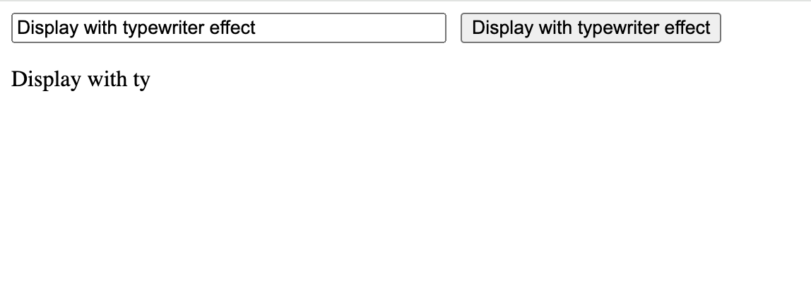

## Typewriter Effect

This is a quick react practice challenge from reactpractice.dev:

Given a sentence, display it with half a second delay between each character.
Start showing nothing and then display characters one by one until the full sentence is displayed.
No style is required.

## Project Screen Shot(s)

#### Example:   

## Installation and Setup Instructions

- `npm install`
- `npm run dev`
- Visit http://localhost:5173/ 

## Reflection

    This was an exercise to better understand using Refs in React as well as setInterval. 
